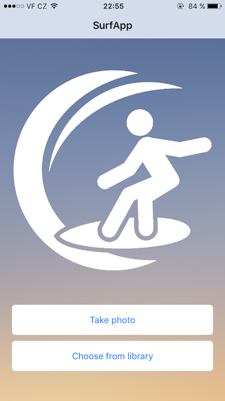

# Zadaní semestrání práce a specifikace požadavků

### Podobnost obrázků (SURF)

Cílem bylo vytvořit mobilní aplikaci, která bude umožňovat vyhledat podobne obrázky na základě podobností pomocí metody SURF. Jednoduchým vyfocením, či vybráním obrázku mobilním telefonem se nahraje obrázek na server, kde proběhne porovnání. Server po přijetí obrázku vyhodnotí nejpodobnější obrázky a následně vrátí odpověd mobilní aplikaci. Backend server bude implementován v jazyce Java Enterprise Edition a bude poskytovat RESTFull webové služby a zároveň bude server sloužit jako databáze pro obrázky.

# Implementační část - Backend server
### Základní specifikace
Celý výpočet a veškerá podpora mobilní aplikace je tvořena backeckend serverem, který implementuje RESTFull API. Pro implementaci jsme zvolili programovací jazyk Java Enterprise Edition, se kterým máme pracovní zkušenosti. 

Ikdyž je J2EE multiplatformní jazyk, finální projekt je nasazen na linuxovém serveru distribuce Debian 8.0 označený názvem Jessie. Jako aplikační server byl zvolen Wildfly 9.0.2, což je komunitní verze známějšího komerčního aplikačního serveru  JBoss.  

Abychom si usnadnily build a deploy proces pro správu projektu jsme zvolili nástoj Maven. I přesto, že je struktura projektu vcelku jednoduchá, použití Mavenu nám usnadnilo používání již vytvořených knihoven  jako jsou například:
- RESTEasy
    - nativní implementace RESTFull webservices pro kontejner aplikačního serveru Wildfly
- Hibernate 
    - Java Persistence API framework používaný pro napojení relační databáze
- BoofCV 
    - komplexní knihovna pro získávaní dat z médií, kterou jsme využili na oné zíkávání význačných bodů (Interests points) obrazů metodou SURF
- Další podpůrné knihovny 

Pro ukládání obrázků jsme zvolili implementaci relační databáze známé jako MySQL. 

### Způsob ukládání a přenášení dat fotografií
Všekeré přijaté fotografie jsou v databázi uloženy jako datový typ LONGBLOB, který se pomocí JPA interpretuje při zpracovávání jako byte array. Mobilní aplikace odesílá pouze fotografii převedenou do formátu BASE64 a znakové sady UTF-8. Aplikační server následné pracuje již se zmíněným byte array. 

### Popis webových služeb
```java
BASE_URL=http://<deploy_server_url>:8080/surfapp/api/photo
==========================================================
BASE_URL
@GET
@Produces("application/json")
popis: vrátí všechny fotografie v databázi
==========================================================
@GET
@Path("find10/id/{id}")
@Produces("application/json")
popis: Testovací resource, která porovnává fotografie z obrázku dle vybrané fotografie zadané ID fotografií
==========================================================
@GET
@Path("show/id/{id}")
@Produces({"image/png", "image/jpeg"})
popis: Resource, který vrátí fotografii dle ID - zobrazitelné jako png či jpeg
==========================================================
@POST
@Path("upload")
@Consumes("multipart/form-data")
@Produces("application/json")
popis: Resource pro nahrávání fotografií ve formátu multipart/from-data. Vrátí seznam fotografií seřázené dle podobnosti
==========================================================
@POST
@Path("upload64")
@Consumes("application/json")
@Produces("application/json")
popis: Resource pro nahrávání fotografií ve formátu json - fotografie je zadané BASE64. Vrátí seznam fotografií seřazené dle podobnosti
==========================================================
```
### Implementace algoritmu porovnávání fotografií
Algoritmus pro výpočet je náseldovný:
 - Pro porovnávaný obrázek napočítáme všechny descriptory (OBRAZEK1)
 - Pro ostatní obrázky, které se kterými chceme porovnávat také napočítáme descriptory
 - následně porovnáme první descriptor OBRAZKU1 se všemi descriptory provnávaného obrázku.
    - porovnání je provedené výpočtem vzdálenosti dvou vektorů Euklidovskou metodou
 - získané vzdálenosti seředíme od od nejmenší po největší
 - spočítáme podíl mezi první a druhou nejmenší vzdáleností a pokud je v poměr menší než námi zadaná mez zjistili  jsme shodu.
 - takto napočítáme shody pro všechny descriptory a výsledkem by měl být počet shod.
 - takto napočítáme shody pro všechny obrázky vůči porovnávanému obrázku
 - výsledný seznam seřadíme a dostaneme tak nejpodobnější obrazky seřazené dle podobností

Pro zvýšení rychlosti agoritmu jsme využili paralelismu a počítáme paralelně více obrázků najednou. Dosáhli jsme tím výrazného zrychlení cca 50%. Nástin algoritmu je v následující ukázce.
```java
public static List<PhotoFile> findParallel(PhotoFile origPhoto, List<PhotoFile> allPhotoFiles) {
        List<PhotoFile> res = new ArrayList<>();
        try {
            res = processInputs(allPhotoFiles, origPhoto);
        } catch (InterruptedException ex) {
            Logger.getLogger(SURFApi.class.getName()).log(Level.SEVERE, null, ex);
        } catch (ExecutionException ex) {
            Logger.getLogger(SURFApi.class.getName()).log(Level.SEVERE, null, ex);
        }
        Collections.sort(res);
        return res;
    }

    private static List<PhotoFile> processInputs(List<PhotoFile> inputs, PhotoFile origPhoto)
            throws InterruptedException, ExecutionException {
        int threads = Runtime.getRuntime().availableProcessors();
        System.out.println(threads);
        ExecutorService service = Executors.newFixedThreadPool(threads);
        BufferedImage origImageBuff = getBufferedImage(origPhoto);
        ImageFloat32 origImage = new ImageFloat32(origImageBuff.getWidth(), origImageBuff.getHeight());
        origImage = ConvertBufferedImage.convertFrom(origImageBuff, origImage);
        DetectDescribePoint<ImageFloat32, SurfFeature> surf = FactoryDetectDescribe.
                surfStable(new ConfigFastHessian(0, 2, 200, 2, 9, 4, 4), null, null, ImageFloat32.class);
        surf.detect(origImage);
        final List<SurfFeature> origImageList = getSurfFeatureList(surf);
        List<Future<PhotoFile>> futures = new ArrayList<Future<PhotoFile>>();
        for (final PhotoFile input : inputs) {
            Callable<PhotoFile> callable = new Callable<PhotoFile>() {
                @Override
                public PhotoFile call() throws Exception {
                    PhotoFile output = new PhotoFile();

                    long start = System.currentTimeMillis();
                    DetectDescribePoint<ImageFloat32, SurfFeature> surf = FactoryDetectDescribe.
                            surfStable(new ConfigFastHessian(0, 2, 200, 2, 9, 4, 4), null, null, ImageFloat32.class);
                    BufferedImage testImageBuff = getBufferedImage(input);
                    ImageFloat32 testImageFloat = new ImageFloat32(testImageBuff.getWidth(), testImageBuff.getHeight());
                    testImageFloat = ConvertBufferedImage.convertFrom(testImageBuff, testImageFloat);
                    surf.detect(testImageFloat);
                    List<SurfFeature> matches = new ArrayList<>();
                    for (SurfFeature sf : origImageList) {
                        List<Double> distances = new ArrayList<>();
                        for (int i = 0 ; i< surf.getNumberOfFeatures() ; i++) {
                            distances.add(DescriptorDistance.euclideanSq(sf, surf.getDescription(i)));
                        }
                        Collections.sort(distances);

//                        if (distances.get(0) == 0) {
//                            if ((distances.get(1) / distances.get(2)) < MAX_THRESHOLD && (distances.get(1) / distances.get(2)) > MIN_THRESHOLD) {
//                                matches.add(sf);
//                            }
//                        } else if ((distances.get(0) / distances.get(1)) < MAX_THRESHOLD && (distances.get(0) / distances.get(1)) > MIN_THRESHOLD) {
//                            matches.add(sf);
//                        }
                        if ((distances.get(0) / distances.get(1)) < MAX_THRESHOLD && (distances.get(0) / distances.get(1)) > MIN_THRESHOLD) {
                            matches.add(sf);
                        }

                    }
                    long elapsedTimeMillis = System.currentTimeMillis() - start;
                    float elapsedTimeSec = elapsedTimeMillis / 1000F;
                    LOG.info("elapsedTimeSec: " + elapsedTimeSec);
                    System.out.println("Matches: " + matches.size());
                    output.setCreateDate(input.getCreateDate());
                    output.setId(input.getId());
                    output.setSimilarity((double) matches.size());
                    return output;
                }
            };
            futures.add(service.submit(callable));
        }
        service.shutdown();
        List<PhotoFile> outputs = new ArrayList<PhotoFile>();
        for (Future<PhotoFile> future : futures) {
            outputs.add(future.get());
        }
        return outputs;
    }

    private static List<SurfFeature> getSurfFeatureList(DetectDescribePoint<ImageFloat32, SurfFeature> surf) {
        List<SurfFeature> list = new ArrayList<>();
        for (int i = 0; i < surf.getNumberOfFeatures(); i++) {
            list.add(surf.getDescription(i));
        }
        return list;
    }
```

# Implementační část - iOS mobilní aplikace

### Základní specifikace

Jako uživatelské rozhraní jsme zvolili jednoduchou mobilní aplikaci pro systém iOS. Uživatel vyfotí, nebo vybere dříve vyfocenou fotografii, pro kterou chce v databázi najít nejpodobnější výsledky. Fotografie je odeslána na server a po provedení výpočtu jsou uživateli zobrazeny nejpodobnější výsledky.

Aplikace je napsána v jazyce Swift a pro svůj běh vyžaduje systém iOS verze 8.0 a vyšší. Prostřednictvím balíčkovacího systému CocoaPods jsme využili několika užitečných knihoven pro usnadnění implementace:
- Alamofire
    - zřejmě nejpopulárnější knihovna pro síťovou komunikaci v iOS aplikacích
- SwiftyJSON
    - knihovna usnadňující serializaci/deserializaci dat do/z JSON formátu
- SnapKit
    - jednoduchá syntaktická nadstavba nativního AutoLayoutu
- MWPhotoBrowser
    - komplexní implementace fotogalerie včetně podpory gest

### Přenos dat

Nad vybranou fotografií je nejprve provedena komprese (JPEG, 0.3) a následně je převedena do formátu BASE64. Data jsou následně odeslána na server metodou POST prostřednictvím jednoduchého REST API. Po provedení výpočtu na serveru je výsledek vrácen jako odpověď na odeslaný požadavek POST.

```ios
func imagePickerController(picker: UIImagePickerController, didFinishPickingMediaWithInfo info: [String : AnyObject]){
    
  //convert img to base64
  let selectedImage = info[UIImagePickerControllerOriginalImage] as? UIImage
  let imageData = UIImageJPEGRepresentation(selectedImage!, 0.3)
  let base64String = imageData!.base64EncodedStringWithOptions(.EncodingEndLineWithCarriageReturn)

  //prepare POST
  let headers = [
    "Content-Type": "application/json;charset=UTF-8"
  ]
  let data = [
    "data": "\(base64String)"
  ]
    
  //dismiss imagePicker
  SVProgressHUD.showWithStatus("Loading results", maskType: SVProgressHUDMaskType.Clear)
  self.imagePicker.dismissViewControllerAnimated(true, completion: nil)
    
  //send img to api
  Alamofire.request(.POST, "https://<deploy_server_url>:8443/surfapp/api/photo/upload64", headers: headers, parameters: data, encoding: .JSON)
    .responseJSON { response in
        
      switch response.result {
          
      case .Success:
        if let value = response.result.value {
          let json = JSON(value)
          print("JSON: \(json)")
            
          //push results view controller
          let resultsViewController: SAResultsViewController = SAResultsViewController(photo: selectedImage!, results: json)
          self.navigationController!.pushViewController(resultsViewController, animated: true)
        }
          
      case .Failure(let error):
        print(error)
        SVProgressHUD.showErrorWithStatus("Network error\nCan't send photo")
      }
        
    }
    
}
```

### Ukázka UI



[//]: # (These are reference links used in the body of this note and get stripped out when the markdown processor does its job. There is no need to format nicely because it shouldn't be seen. Thanks SO - http://stackoverflow.com/questions/4823468/store-comments-in-markdown-syntax)


   [dill]: <https://github.com/joemccann/dillinger>
   [git-repo-url]: <https://github.com/joemccann/dillinger.git>
   [john gruber]: <http://daringfireball.net>
   [@thomasfuchs]: <http://twitter.com/thomasfuchs>
   [df1]: <http://daringfireball.net/projects/markdown/>
   [marked]: <https://github.com/chjj/marked>
   [Ace Editor]: <http://ace.ajax.org>
   [node.js]: <http://nodejs.org>
   [Twitter Bootstrap]: <http://twitter.github.com/bootstrap/>
   [keymaster.js]: <https://github.com/madrobby/keymaster>
   [jQuery]: <http://jquery.com>
   [@tjholowaychuk]: <http://twitter.com/tjholowaychuk>
   [express]: <http://expressjs.com>
   [AngularJS]: <http://angularjs.org>
   [Gulp]: <http://gulpjs.com>
   
   [PlDb]: <https://github.com/joemccann/dillinger/tree/master/plugins/dropbox/README.md>
   [PlGh]:  <https://github.com/joemccann/dillinger/tree/master/plugins/github/README.md>
   [PlGd]: <https://github.com/joemccann/dillinger/tree/master/plugins/googledrive/README.md>
   [PlOd]: <https://github.com/joemccann/dillinger/tree/master/plugins/onedrive/README.md>


